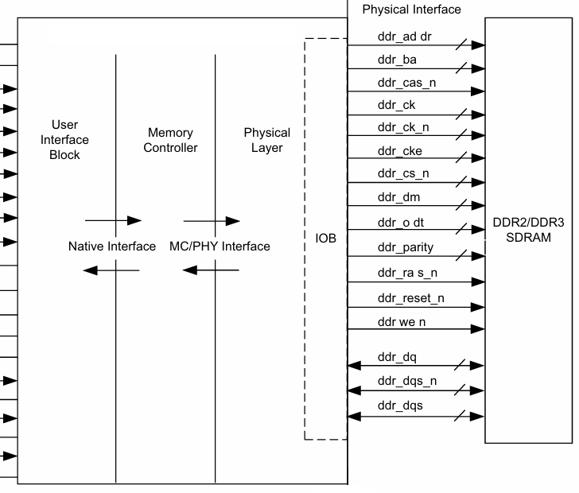

# ddr_controller

## Introduction

It's a light weight ddr3 controller on FPGA.



## Directory

- doc
- rtl
  - config: configure macros in `mc_config.svh` 
  - mc: rtl of the mc
  - phy: [opensource phy](https://github.com/ultraembedded/core_ddr3_controller/tree/master/src_v/phy)
- tb: testbench of mc_native and mc_axi

## Getting Started

### Dependencies

- RTL Simulator
  - Vivado (2019.2 has been tested)
- Wave Viewer
  - [gtkwave](https://github.com/gtkwave/gtkwave) 

### Usage

#### Simulation

Run simulation:

```shell
make sim TB=[default: mc_axi_vip]
# TB: see ./rtl/tb/tb_*.sv
```

Get waveform:

```shell
make wave
```
